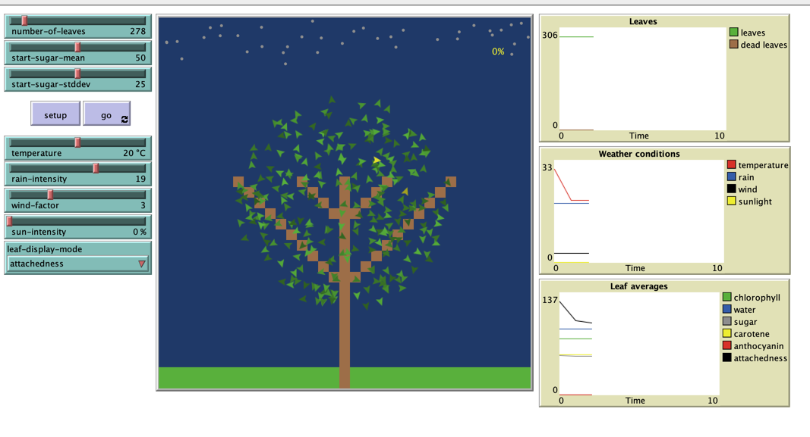
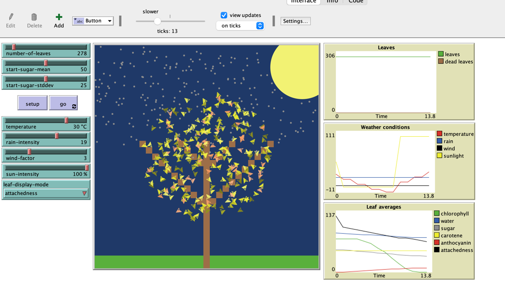
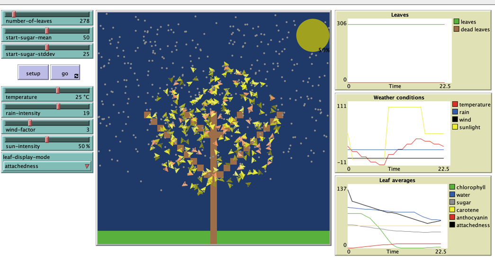
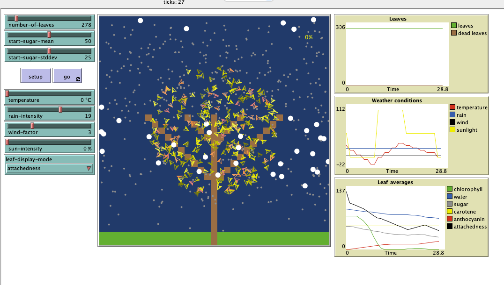
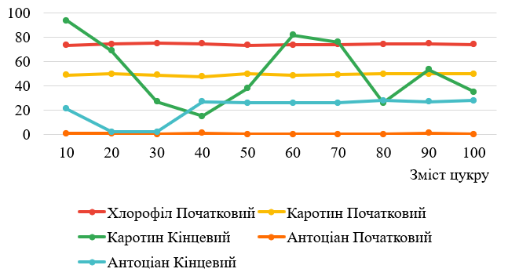

## Комп'ютерні системи імітаційного моделювання

## СПм-22-5, **Стеблянко Богдан**

### Лабораторна робота №**2**. Редагування імітаційних моделей у середовищі NetLogo

### Варіант 11, модель у середовищі NetLogo:

[Autumn](https://www.netlogoweb.org/launch#http://www.netlogoweb.org/assets/modelslib/Sample%20Models/Biology/Autumn.nlogo)

### Внесені зміни у вихідну логіку моделі, за варіантом:

**Додати добові цикли зміни інтенсивності сонячного світла, що також повинно впливати на температуру.
Тривалість модельної "доби" встановлюється у внутрішніх параметра**

Тривалість модельної "доби" встановлюється у внутрішніх параметра

Створено глобальні атрибути та пастухів **day-long-ticks**, **current-day-tick**, які відповідають за тривалість "доби" в тактах та за поточний такт:
<pre>
globals [
  day-long-ticks
  current-day-tick    
]
</pre>

Задали значення для **day-long-ticks** та **current-day-tick** в процедурі **setup**
<pre>
to setup
  set day-long-ticks 48
  set current-day-tick 0 
end
</pre>

Додали значення керуючі **day-long-ticks** та **current-day-tick** в процедурі **go**
<pre>
  ifelse current-day-tick < day-long-ticks [
    if current-day-tick mod 2 = 0 [
      change-sun-intensity-and-temperature
    ]
    set current-day-tick current-day-tick + 2
  ] [
    set current-day-tick 0
  ]
</pre>

Додали процедуру **change-sun-intensity-and-temperature** яка буде змінювати інтенсивність сонця та температуру в залежності від часу.
На початку процедури розрахуємо значення поточного часу **let time-of-day current-day-tick / day-long-ticks * 24** з використанням 24 годин на добу.
Далі в залежності від поточного часу на 3 проміжках встановлюємо інтенсивність сонця та температуру.
<pre>
  to change-sun-intensity-and-temperature
  let time-of-day current-day-tick / day-long-ticks * 24

  if time-of-day >= 0 and time-of-day < 8 [
    ;; Ніч: сонце не світить
    set sun-intensity 0
    set temperature (adjust-temparature-limits temperature - 10)
  ]

  if time-of-day >= 8 and time-of-day < 16 [
    set sun-intensity 100
    set temperature (adjust-temparature-limits temperature + 10)
  ]

  if time-of-day >= 16 and time-of-day < 24 [
    set sun-intensity 50
    set temperature (adjust-temparature-limits temperature - 5)
  ]
end
</pre>

Ніч, час (0 - 8]
 
Інтенсивність сонця - 0, температура знижена на 10 градусів
 

 

День, час (9 - 16]
 
Інтенсивність сонця - 100, температура збільшена на 10 градусів
 

 

Вечір, час (16 - 0]
 
Інтенсивність сонця - 50, температура знижена на 5 градусів
 

 

Для зберігання адекватності температури **set temperature** буде проходити за допомогою функції **adjust-temparature-limits**
<pre>
to-report adjust-temparature-limits [ temper ]
  if temper < -10 [ report -10 ]
  if temper > 40 [ report 40 ]
  report temper
end
</pre>

### Внесені зміни у вихідну логіку моделі, на власний розсуд:

**Додані опади у вигляді снігу в разі відʼємної температури**

**Змінено вид опадів в залежності від температури**
температура > 0 - йде дощ
температура <= 0 - йде сніг

<pre>
to make-rain-fall-or-snow
  ifelse temperature > 0 [
    create-raindrops rain-intensity [
      setxy random-xcor max-pycor
      set heading 180
      fd 0.5 - random-float 1.0
      set size .3
      set color gray
      set location "falling"
      set amount-of-water 10
    ]
  ] [
    create-raindrops snow-intensity [
      setxy random-xcor max-pycor
      set heading 180
      fd 0.5 - random-float 1.0
      set size .8
      set color white  
      set location "falling"
      set amount-of-water 10
    ]
  ]
  
  ask raindrops [ fd random-float 2 ]
end
</pre>

**Додано вплив снігу на силу прикріплення листя до дерева,**
Як відомо, коли йде сніг він тяжкий та впливає на те через який час впаде листя.
Зробили метод який при відʼємній температурі та ще "живих" листя зменшує параметр **attachedness**

<pre>
to adjust-snow-attachedness
  if temperature < 0 [
    ask leaves with [attachedness > 0] [
      set attachedness attachedness - 2
    ]
  ]
end
</pre>

Фінальний код моделі та її інтерфейс доступні за [посиланням](Autumn.nlogo).
 

## Обчислювальні експерименти

### 1. Вплив змісту цукру на показники Хлорофілу(зелений кольор), Каротину(жовтий кольор) та Антоціану(червоний кольор) в змісті листя

Досліджується залежність змісту цукру на показники Хлорофілу, Каротину та Антоціану в змісті листя (зміну кольору листя) за 75 тактів.
Експерименти проводяться при 10 - 100 % змісту цукру, з кроком 10, усього 10 симуляцій.  
Інші керуючі параметри мають значення за замовчуванням:

- **number-of-leaves**: 800
- **start-sugar-stddev**: 25
- **temperature**: - змінна в залежності від часу
- **rain-intensity**: 19
- **wind-factor**: 3
- **sun-intensity**: - змінна в залежності від часу

<table>
<thead>
<tr><th>Зміст Цукру</th><th>Хлорофіл Початковий</th><th>Хлорофіл Кінцевий</th><th>Каротин Початковий</th><th>Каротин Кінцевий</th><th>Антоціан Початковий</th><th>Антоціан Кінцевий</th></tr>
</thead>
<tbody>
<tr><td>10</td><td>73,7</td><td>0</td><td>48,86</td><td>94</td><td>0,67</td><td>21</td></tr>
<tr><td>20</td><td>74,6</td><td>0</td><td>50</td><td>69</td><td>0,79</td><td>2</td></tr>
<tr><td>30</td><td>75,3</td><td>0</td><td>49,1</td><td>27</td><td>0</td><td>2</td></tr>
<tr><td>40</td><td>74,7</td><td>0</td><td>47,6</td><td>15</td><td>0,95</td><td>27</td></tr>
<tr><td>50</td><td>73,4</td><td>0</td><td>49,9</td><td>38</td><td>0</td><td>26</td></tr>
<tr><td>60</td><td>73,8</td><td>0</td><td>48,7</td><td>82</td><td>0</td><td>26</td></tr>
<tr><td>70</td><td>74,3</td><td>0</td><td>49,3</td><td>76</td><td>0</td><td>26</td></tr>
<tr><td>80</td><td>74,4</td><td>0</td><td>49,8</td><td>26</td><td>0</td><td>28</td></tr>
<tr><td>90</td><td>75</td><td>0</td><td>49,8</td><td>53,5</td><td>1</td><td>27</td></tr>
<tr><td>100</td><td>74,2</td><td>0</td><td>49,9</td><td>35</td><td>0</td><td>28</td></tr>
</tbody>
</table>

Висновки експерименту:

- Зміна часу доби не впливає на те, що листя може залишитися зеленуватим.
- Зміна часу доби приводило до того, що зміст каротину та антоціану збільшувався повільніше ніж с фіксовною температурою та інтенсивністю сонця, листя починало приймати
  жовто-червоний окрас повільніше.
- Значення вмісту каротину та антоціану збільшувалися більш поступово, бо сонце та температура впливали поступово спочатку живили листя, а у вечері на ночі листя втрачало
  природне живлення, модель тала більш реалістична.